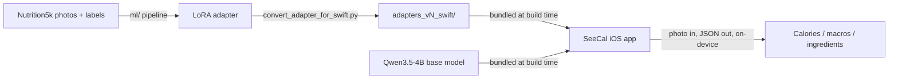

# SeeCal

Point your phone at a plate of food. Get calories, macros, and a per-ingredient
breakdown back — entirely on-device, no server, no network call.

SeeCal fine-tunes **Qwen3.5-4B** (natively multimodal — vision is built in,
no separate VL model) on the **Nutrition5k** dataset with a LoRA adapter, then
runs the resulting base-model-plus-adapter directly on iPhone via MLX Swift.

## How it works



The two halves — the training pipeline and the iOS app — never share code.
They agree only on a narrow contract: a converted adapter directory, and a
prompt string that must be byte-identical on both sides (Qwen's chat
template is unforgiving about this — see `docs/architecture.md`). That
contract is what lets the ml side retrain and the iOS side ship UI changes
independently.

## Results

MAE / median absolute calorie error on the **full 325-dish** held-out set
(`ml/finetune_data_v2/test.jsonl`, via `ml/infer.py` / `ml/eval.sh`):

| Model | Calories MAE | Calories median | Parse failures | Refuses non-food |
|---|---:|---:|---:|:--:|
| Base model (no adapter) | 83.4¹ | 63.9¹ | 0 | no |
| `adapters_v5` | 59.0 (n=322) | 31.4 | 3 | no |
| **`adapters_v7b` (shipping)** | **63.4 (n=324)** | **30.5** | **1** | **yes** |

¹ 50-dish sample; the base model was never run over the full set.

**Read the MAE column carefully.** Parse failures are excluded per-adapter, so
v5's 59.0 (n=322) and v7b's 63.4 (n=324) are computed over *different dish
sets* and are not directly comparable. Paired on the 324 dishes both answered,
v5 is 62.5 and v7b 63.4 — a difference of +0.87 kcal (t = 0.23, not
significant), with v7b's median better and its parse failures fewer. v7b adds
not-food refusal (100% recall on 29 held-out non-food images, 0 false refusals
on 324 real dishes) at no measurable food-accuracy cost.

See `ml/README.md` for the complete metrics table (including the
depth-augmented `adapters_v6`, a measured tie that was not shipped, and
`adapters_v7`, whose heavier negative dose caused a real regression),
`docs/plans/2026-07-27-v7-notfood-plan.md` for the refusal experiment, and
`docs/training-history.md` for the four earlier, broken training runs.

## Quickstart

**Training pipeline** (Apple Silicon required — mlx/mlx-vlm are Metal-only):

```bash
cd ml
./setup.sh                                       # python env (mlx-vlm 0.6.7 stack)
./download_dataset.sh                            # Nutrition5k subset (CC BY 4.0, not committed)
./download_model.sh                              # Qwen3.5-4B-MLX-4bit base model
export MODEL_PATH=~/models/mlx-community/Qwen3.5-4B-MLX-4bit
./prep.sh && ./train.sh && ./eval.sh adapters_v5 --limit 325 && ./convert.sh adapters_v5
```

To reproduce the **shipping** adapter (v7b, which adds not-food refusal), see
"Reproducing v7b from scratch" in `AGENTS.md` — it needs the COCO negatives
step (`./download_negatives.sh`) in addition to the above.

Full walkthrough, hardware requirements, and the validation ladder (never
skip straight to a multi-hour training run) in **`ml/README.md`**.

**iOS app** (Xcode 26+, iOS 17+, physical iPhone 15 Pro+ recommended — the
simulator builds fine but can't run real MLX inference):

```bash
SEECAL_ALLOW_NO_WEIGHTS=1 scripts/build.sh       # fast UI-only simulator build
MODELS_DIR=/path/to/models scripts/build.sh --device   # signed device build, weights bundled
scripts/test.sh                                  # ml pytest + swift test + iOS build check
```

Full walkthrough, weights-bundling layout, and release flow (TestFlight /
App Store) in **`ios/README.md`**.

## Repo map

```
ml/       training pipeline: dataset prep, LoRA fine-tuning, evaluation,
          Swift-format adapter conversion. ml/README.md.
ios/      SeeCal SwiftPM package (all app code) + thin XcodeGen app wrapper.
          ios/README.md, ios/SeeCal/README.md.
scripts/  build.sh, test.sh, release-{setup,testflight,appstore}.sh.
docs/     architecture.md (the ml <-> iOS contract), training-history.md
          (every training bug, in forensic detail), third-party.md (license
          audit), specs/ + design/ (the binding app spec and visual
          prototype), plans/ (dated planning docs).
attic/    retired one-off scripts, kept for reference only.
```

`AGENTS.md` is a short agent-facing guide to the same material — read the
docs above for the full version.

## License

The code in this repository is **MIT-licensed** — see `LICENSE`.

That covers the code only:

- **Nutrition5k** (the training dataset) is Google Research's, released
  under **CC BY 4.0**. It is never committed to this repo — `ml/download_dataset.sh`
  downloads your own copy directly from the dataset's public bucket, under
  the dataset's own terms.
- **Qwen3.5** (the base model) is Alibaba's, released under the
  **Apache License 2.0**. It is downloaded from Hugging Face
  (`ml/download_model.sh`), not redistributed here.
- **Fine-tuned LoRA adapter weights** produced by this pipeline are not
  committed to this repository either.

See `docs/third-party.md` for the full dependency license audit (mlx,
mlx-vlm, mlx-swift, mlx-swift-lm, transformers, XcodeGen, etc. — nothing
copyleft anywhere in the stack).
