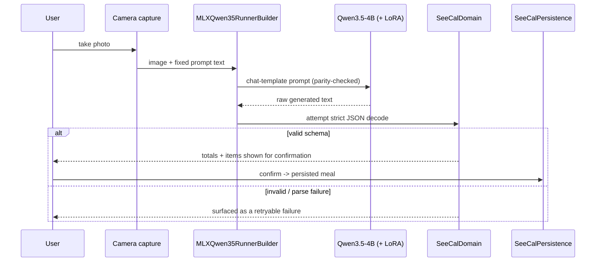
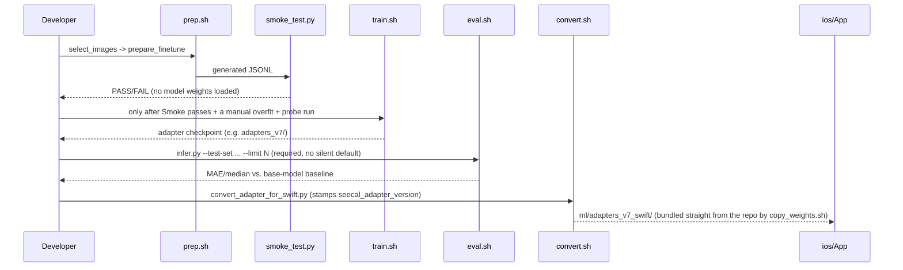

# Architecture

SeeCal is two independent halves that only agree to meet at one narrow
contract: **an adapter directory and an exact prompt string**. Everything
upstream of that (dataset, training) and downstream of it (UI, persistence)
never needs to change in lockstep.

```mermaid
flowchart LR
    subgraph ML["ml/  (training pipeline, Python + mlx-vlm)"]
        A[Nutrition5k dataset] --> B[select_images.py]
        B --> C[prepare_finetune.py]
        C --> D[train/valid/test JSONL]
        D --> E[smoke_test.py]
        E -->|gate| F[train.sh: LoRA fine-tune]
        F --> G[adapter checkpoint]
        G --> H[eval.sh / infer.py]
        G --> I[convert_adapter_for_swift.py]
    end

    subgraph Contract["The contract"]
        I --> J["adapter_config.json +\nadapters.safetensors\n(+ seecal_adapter_version)"]
        K["Qwen chat-template prompt\n(byte-identical both sides)"]
    end

    subgraph IOS["ios/  (on-device app, Swift)"]
        J --> L[LoRAContainer]
        K --> M[MLXQwen35RunnerBuilder]
        L --> M
        M --> N[JSON scan result]
        N --> O[SeeCalDomain validation]
        O --> P[SeeCalPersistence + UI]
    end

    style Contract fill:#333,stroke:#999,color:#fff
```



## The two halves

**`ml/`** owns everything from raw Nutrition5k data to a trained LoRA
adapter: image selection, JSONL generation, the validation ladder, LoRA
fine-tuning (mlx-vlm on Apple Silicon), evaluation, and the final conversion
step that hands an adapter to iOS. See `ml/README.md` for the full
walkthrough and `docs/training-history.md` for how that pipeline reached its
current, working shape.

**`ios/`** owns everything from a captured photo to a persisted meal: camera
capture, on-device MLX inference (base model + optional LoRA adapter),
strict JSON validation, meal storage, and the SwiftUI screens. See
`ios/README.md` and `ios/SeeCal/README.md`.

Neither half imports the other's code. The only things that cross the
boundary are files (an adapter directory) and a shared understanding of
*exactly* what text gets sent to the model.

## The contract, in detail

### 1. JSON output schema

Both halves target the same strict schema — the training data's assistant
turns are generated in this shape (`ml/prepare_finetune.py`), and
`SeeCalDomain`'s decoder rejects anything that doesn't match it
(`ios/SeeCal/README.md`, "Required output schema"):

```json
{
  "total_calories": 640,
  "protein_g": 42,
  "fat_g": 22,
  "carbs_g": 71,
  "items": [
    {"name": "chicken", "estimated_grams": 150, "calories": 280,
     "protein_g": 34, "fat_g": 8, "carbs_g": 0}
  ]
}
```

There is no `"calories"`, `"mass_g"`, or `"ingredients"` top-level key by
design — every field name above is exact and both sides must agree on it.
Items are sorted by grams descending in training data; the model is expected
to reproduce that ordering, though the app does not require it.

### 2. Prompt byte-parity

The single hardest-won invariant in this project (`docs/training-history.md`
fixes #4, #5, #10, #14, #15) is that the exact same prompt text — same
instruction wording, same lack of a system message, same vision-token
placement — must reach the model at training time and at inference time. If
they diverge even slightly, the LoRA adapter learns a mapping for a prompt
the app never actually sends it, and output quality silently degrades or
collapses (see the Run 1–3 post-mortems).

- **Training side**: `ml/prepare_finetune.py` generates
  `{"role": "user", "content": [{"type": "image", ...}, {"type": "text", ...}]}`
  records with no system message (folded into the user text instead — Qwen's
  chat template rejects list content in the system role).
- **Inference side (Python)**: `ml/infer.py` builds the prompt via
  `mlx_vlm.prompt_utils.apply_chat_template`, then strips the trailing
  `<think>\n` Qwen3.5 appends for direct JSON output.
- **Inference side (Swift)**: `MLXQwen35RunnerBuilder` builds the equivalent
  prompt through `mlx-swift-lm`'s Qwen3.5 chat template.
- **Enforcement**: `ml/check_prompt_parity.py` is the automated gate on the
  Python side — for each of the current dataset variants
  (`finetune_data_v2/`, `finetune_data_v2d_txt/`, `finetune_data_v2d_img/`) it
  asserts (a) the inference prompt equals the trainer's completion-mask
  prefix, byte for byte, and (b) the full training text equals that prefix
  plus the assistant JSON plus `<|im_end|>`. `ml/smoke_test.py` is the
  earlier, cheaper gate — it runs real JSONL records through the batch
  pipeline (processor + config only, no model weights, ~1 minute) and fails
  loudly on every failure mode that has previously broken this contract:
  missing `pixel_values`, an empty or leaking completion mask, or an
  image-token count that doesn't match `image_grid_thw`. Neither of these
  gates has a Swift-side automated equivalent yet — Swift-side parity is
  currently verified by manual probe (see `docs/training-history.md`, Run 4).

### 3. Adapter format + version stamping

mlx-vlm (training) and mlx-swift-lm's `LoRAContainer` (inference) use
different on-disk conventions for the same LoRA math. `ml/convert_adapter_for_swift.py`
bridges them:

- **Weight keys**: mlx-vlm emits `.A` / `.B`; `LoRAContainer` expects
  `.lora_a` / `.lora_b` (same tensor layout, pure rename — no transpose).
- **Scale convention**: current mlx-vlm (>= 0.6.7) computes effective scale
  as `alpha / rank`; the retired legacy stack used a bare `alpha` as the
  scale directly. The converter detects which convention produced the input
  adapter (by weight-key suffix — `.A`/`.B` implies legacy) and always emits
  the *effective* scale, so `LoRAContainer` never has to know which stack
  trained the adapter.
- **`seecal_adapter_version` stamping**: the converter writes a
  `seecal_adapter_version` key into the output `adapter_config.json` (e.g.
  `"v5"`). `ModelInfoResolver.adapterVersionLabel`
  (`ios/SeeCal/Sources/SeeCalInference/ModelInfoResolver.swift`) reads this
  key first, for the Settings screen's model card, and only falls back to
  parsing a trailing `_v<N>` off the adapter *directory name* when the key is
  absent (e.g. for an adapter converted before this stamping existed) — see
  `ModelInfoResolver.versionSuffix`. This is the forward-compatible path: any
  future renaming of adapter directories away from the `adapters_vN`
  convention still resolves correctly as long as the config is stamped.

### 4. Weights bundling

Neither the base model nor any adapter is committed to git. `ios/App`'s
"Bundle model weights" build phase (`ios/App/copy_weights.sh`) copies a
`$MODELS_DIR` (containing the base model under `mlx-community/...` and,
optionally, a converted adapter under `adapters/`) into the app bundle at
build time. `ModelAssetResolver`
(`ios/App/Sources/ModelAssetResolver.swift`) then resolves, at runtime, in
order: bundled resources → (device only) `Documents/`/`Application Support`
for side-loading or download-on-first-launch → (simulator only) a hardcoded
local development path, used only if it happens to exist on the machine
running the simulator. A missing adapter is a logged, non-fatal degradation
(the app runs the base model); an adapter directory that exists but fails to
load is treated as a bug and raises, with no silent fallback. See
`ios/README.md`'s "Weights bundling" section for the exact directory layout.

## Data flow: one inference request



## Data flow: producing a new adapter



## Where each invariant is enforced

| Invariant | Enforced by |
|---|---|
| JSONL image paths resolve correctly | Every pipeline command documented to run from `ml/`; `smoke_test.py` fails immediately if images don't load |
| Vision encoder actually receives pixels | `smoke_test.py` (checks `pixel_values` presence, image-token counts) |
| Completion mask covers only the JSON completion | `smoke_test.py` (checks mask isn't empty and doesn't leak onto image/prompt tokens) |
| Training prompt == inference prompt, byte-for-byte | `ml/check_prompt_parity.py` |
| `--limit` is never silently defaulted for a full eval | `ml/eval.sh` refuses to run without an explicit `--limit` |
| Adapter scale convention is translated, not copy-pasted | `ml/convert_adapter_for_swift.py` (detects legacy vs. current mlx-vlm by weight-key suffix) |
| App always knows which adapter it's running | `ModelInfoResolver` (reads `seecal_adapter_version`, falls back to directory-name parsing, never fabricates a version) |
| App never sends inference to a broken adapter silently | `ModelAssetResolver` + `MLXQwen35RunnerBuilder` (missing adapter = logged fallback to base model; invalid adapter = hard error) |
| Weights never enter git | `.gitignore` (`ml/adapters*/`, `*.safetensors`, `ml/Nutrition5K/`, etc.); `ios/App` build phase fails loudly if `$MODELS_DIR` is unset (unless `SEECAL_ALLOW_NO_WEIGHTS=1`) |
